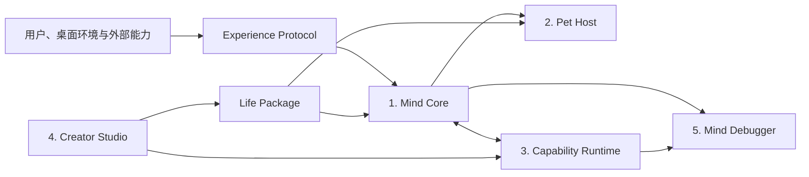

# LIFE-Mind 平台架构

## 定位

LIFE-Mind 是一个开放式角色生命引擎。角色不仅会聊天和执行任务，还能通过工作、社交、
观察、独处、失败与自主选择，形成可追溯的关系历史和人物成长弧。

> 她不是被设定成谁，而是会因为与你和这个世界共同生活，逐渐成为谁。

技术上，它是一个可嵌入不同桌宠表现层的、事件驱动、可解释、隐私优先的长期人格与叙事
成长引擎。仓库内的像素桌宠是参考宿主，不是心智内核唯一允许的外观。

## 五个产品边界



| 产品 | 责任 | 本仓库当前状态 |
|---|---|---|
| Mind Core | 状态、社会评价、记忆、关系、决策、成长证据 | 已有可运行的确定性参考实现和一条人物弧 |
| Pet Host | 桌面窗口、身体语言、气泡、房间、渲染器 | 已有 Windows/Tkinter 像素 Sprite 参考宿主；多渲染器和桌面空间感知未完成 |
| Capability Runtime | 工具生命周期、权限、配额、网络和数据隔离 | 只有 Manifest 数据契约与授权判定原语；尚无插件加载器或安全沙箱 |
| Creator Studio | 角色、动画、成长弧和能力包制作 | 已有 JSON Schema、示例和命令行校验；尚无图形编辑器或市场 |
| Mind Debugger | 事件、召回、候选行为、关系和成长回放 | 参考宿主已有开发者面板；自动人格漂移检测仍待实现 |

“部分实现”不能被解释为安全承诺。例如 Capability Manifest 能拒绝未声明权限，但它本身
不是进程沙箱，也不会自动隔离第三方代码。真正的 Capability Runtime 完成前，项目不加载
不受信任的插件。

模型、语音、能力和渲染器的宿主无关边界定义在 `life_mind/ports.py`。这些 Protocol 让实现
可以替换，但不会自动赋予实现信任；尤其 `CapabilityAdapter` 只有在隔离运行时完成后才可
加载第三方实现。

## 三个稳定边界

- [Life Package](PUBLIC_CONTRACTS.md#life-package)：定义角色出生条件、表现资源和成长边界，
  不预写最终人格。
- [Capability Manifest](PUBLIC_CONTRACTS.md#capability-manifest)：声明一个能力希望观察、记忆、
  行动或分享什么；声明不等于用户授权。
- [Experience Protocol](PUBLIC_CONTRACTS.md#experience-protocol)：把对话、任务、工具和自主活动
  转换成统一经验，避免 UI 或插件直接修改心智。

三者目前版本都是 `0.1`。小版本仍可能变化，接入方必须检查 `schemaVersion` 和兼容范围。

## 分层心智模型

不是每个变量都在每一帧参与计算。复杂度按影响范围和变化速度压缩：

| 层级 | 内容 | 触发尺度 | 当前主要实现 |
|---|---|---|---|
| L0 | 安全、隐私、权限和不可突破约束 | 每次输入/行动 | 安全仲裁、记忆用途、LLM 写入边界、Manifest 判定 |
| L1 | 身体、需要、注意和情绪 | 分钟/事件 | `domain/models.py`、`simulator.py` |
| L2 | 当前活动、习惯、冷却和动画状态机 | 动作/事件 | `behavior.py`、参考宿主 |
| L3 | 目标、社会评价、候选行为和决策 | 重要事件 | `simulator.py` 的评价与仲裁 |
| L4 | 情景记忆、关系、信念证据 | 事件/日 | `persistence.py`、`mind.py` |
| L5 | 人格成长、自我叙事和人物弧 | 日/周/证据门槛 | 单人物弧参考实现与成长可见性工具 |

动画帧不触发人生反思。L4/L5 只在重要事件、批处理反思或证据门槛到达时运行；模型不可用
时，L0–L3 和已经实现的结构化记忆仍能工作。

## 表现压缩层

普通用户不应面对内部变量面板。Pet Host 接收的是少量可理解的表现意图：

```text
警惕 + 轻微委屈 + 意图不确定 + 不愿升级冲突
                         ↓
后退、表情收敛、暂时减少主动交流
```

当前参考宿主把决策映射到像素动画、符号气泡和语气。普通个人房间只公开当前心情、总体
好感与少量重要日记；完整候选得分、关系分项和成长门槛只在显式开发者模式显示。

跨宿主输出使用 `PresentationIntent`，只包含公共状态、动作片段、符号、短文本、优先级、
持续时间和来源事件编号。当前公共状态为 sleep、idle、busy、attention、celebrate、pensive、
connect，以及体现本项目差异的 private_life。缺少动作时必须回退到同尺度 idle，不能临时
生成会导致角色缩放、左右跳动或身份漂移的替代图片。

## 反人格漂移

长期角色需要区分三种“自我”：

- **Core Self**：气质范围、价值底线、身份边界和不可突破规则；
- **Current Self**：由可追溯证据支持的情绪、关系、信念与成长阶段；
- **Narrated Self**：语言模型在本次表达中对自己的临时描述。

现有代码已经禁止 LLM 直接修改人格、关系、权限和成长阶段。后续漂移检测器还要比较
Narrated Self 与前两层；偏差过大时丢弃或重生成表达，不能把流畅台词当成长证据。

## 性能与长期运行预算

- 动画播放与心智决策解耦；空闲动画不调用 LLM。
- 屏幕、麦克风和网络能力默认不存在；将来启用也必须按事件采样，不做持续监控。
- 反思与记忆整合批处理，高层人格系统低频运行。
- 低电量、高负载和勿扰状态应降低动画与后台活动频率。
- 发布门槛继续保留空闲 CPU、内存、冷启动和 8 小时稳定性实测，不能只靠单元测试宣布达标。

## 当前工程边界

当前公开仓库适合：研究长期人格模型、运行参考像素桌宠、制作兼容数据包、重放成长场景和
贡献安全边界测试。它还不是桌宠市场、通用插件平台、Live2D 工具链或跨平台发行版。

分阶段交付和未完成项见 [路线图](ROADMAP.md)，参考宿主的验收条件见
[MVP 范围与验收标准](MVP_ACCEPTANCE.md)。参考项目取舍见
[吸收矩阵](REFERENCE_PROJECT_STUDY.md)，逐项工程工作见[实施任务](IMPLEMENTATION_BACKLOG.md)。
