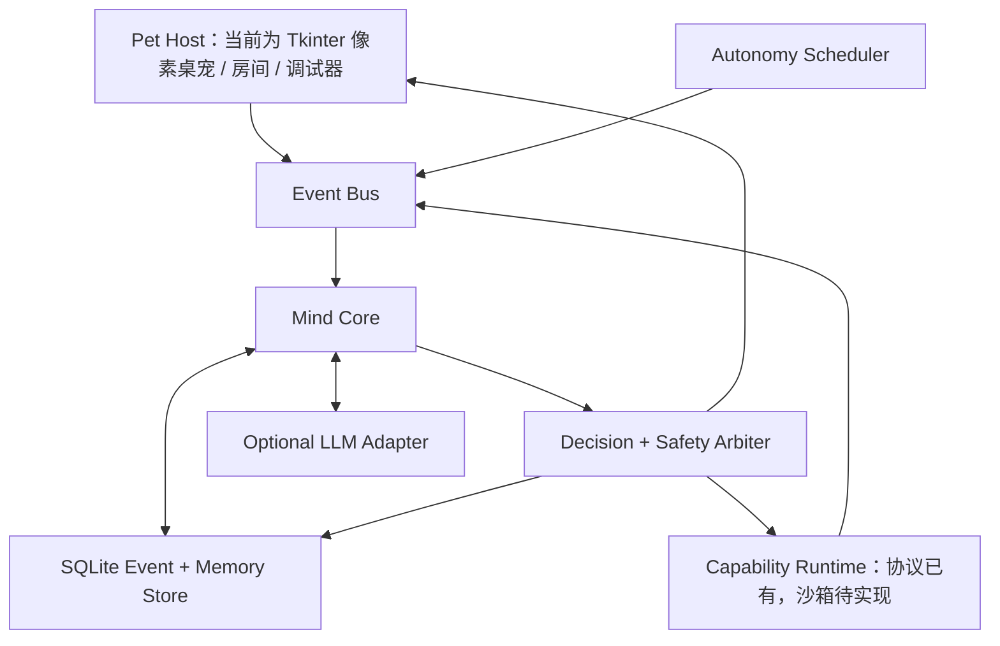

# LIFE-Mind 角色生命引擎蓝图 v0.2

## 1. 产品定义

### 1.1 一句话定位

LIFE-Mind 是一个可嵌入不同桌宠表现层的、事件驱动、可解释、隐私优先的长期人格与叙事成长引擎。本仓库同时提供一只会在 Windows 桌面持续生活的像素桌宠作为参考宿主。

平台五部分、三项公开协议和当前实现状态见[平台架构](PLATFORM_ARCHITECTURE.md)。本文继续描述参考宿主和第一条人物弧的产品蓝图。

### 1.2 用户真正能感受到的差异

用户不需要打开聊天页才能确认她存在：

- 她会根据时间、精力和兴趣自己活动，而不是永远等待指令。
- 她会记住少量真正重要的事情，而不是假装记得所有对话。
- 她能区分建议、误解、尖锐表达和恶意攻击。
- 她可以承认错误，也可以拒绝人格羞辱。
- 她的变化必须有经历、选择、代价和反复验证，不能靠数值升级突然换人格。
- 她拥有私人生活，但不会用“受伤”操控用户留下。

### 1.3 明确不做什么

- 不宣称角色拥有真正意识。
- 不把依赖、嫉妒或制造内疚当作留存机制。
- 不默认读取屏幕、文件、麦克风、聊天记录或浏览器历史。
- 不让语言模型直接覆盖人格、关系、权限或长期记忆。
- 不在首版模拟完整人类心理学。
- 不把所有状态都用聊天文本讲出来；桌宠应主要通过动作、节奏和选择表现自己。

## 2. 首版体验支柱

### 2.1 持续存在

桌宠在应用运行期间拥有生活节奏：醒来、陪伴、专注、休息、玩耍、发呆、反思和睡眠。应用关闭后不伪造复杂社会经历；再次启动时只根据经过时间、已安排活动和身体状态生成一段可解释的离线摘要。

### 2.2 可解释的连续性

每个重要变化都可以追溯：

`发生了什么 -> 她如何理解 -> 产生什么感受 -> 想做什么 -> 最终选择 -> 结果如何 -> 后来怎样反思`

### 2.3 有限自主

她可以主动选择活动、表达偏好、延后非紧急互动、拒绝越界要求，但不能执行高风险系统操作，也不能借情绪报复用户。

### 2.4 低打扰陪伴

默认安静。主动气泡受“打扰预算”限制：普通工作时最多每 30 分钟一次；用户开启专注模式后只保留必要提醒和完成反馈。

### 2.5 安全可控

用户可以查看、纠正、删除、导出记忆；每项外部感知能力都单独授权；云模型接收的信息必须经过选择与脱敏。

## 3. 桌面产品形态

### 3.1 桌宠本体层

一个透明、无边框、可拖动、可穿透切换的置顶角色窗口。

默认只显示角色，不常驻复杂面板。核心动作包括：

- 坐着呼吸、眨眼、环顾
- 陪伴用户专注
- 趴下休息或睡觉
- 偷偷画画、折纸、练习小技能
- 完成协作后拿着结果跑来汇报
- 被突然点到时中断当前动作并做出反应
- 情绪受扰时减少动作和主动表达，而不是夸张演戏

动作必须构成小叙事。例如：

`专注陪伴 -> 悄悄摸鱼画画 -> 发现任务完成 -> 抱着结果慌张跑来汇报 -> 得到回应后恢复平静`

### 3.2 气泡层

气泡不是对话窗口，只承担一到两句短表达：

- 当前意图：“我先陪你安静一会儿。”
- 轻量反馈：“刚才那一步完成了，我检查过一次。”
- 边界表达：“这个我不想直接读取，你可以把需要的部分发给我。”
- 不确定性：“我可能误会你的语气了，要不要告诉我你更接近哪种意思？”

长对话点击气泡后进入“坐下来聊”面板。

### 3.3 个人房间

一个可展开的 420×560 纵向窗口，是角色自愿公开部分的可视化，而不是读取内部状态的监控页。

普通用户只看到：

- 当前心情：经过公开标签处理的总体心情，不展示精力、压力、原因或内部变量；
- 总体好感：一个聚合值和自然语言标签，不展示信任、安全、尊重等关系分项；
- 重要日记：只显示她愿意公开、且重要性达到门槛的少量日记。

任务、用户数据治理和 AI 设置仍可作为独立功能存在，但不能伪装成她的私人房间。成长阶段、证据门槛、全部回忆、当前动机和关系明细一律属于黑箱。

### 3.4 心智调试器

只在显式 `--developer-mode` 下显示，用于验证系统而不是给普通用户“看脑内数值”。

必须能查看：

- 当前快速变量及变化原因
- 本次感知到与忽略掉的事件
- 召回了哪些记忆、来源和置信度
- 各行为提议、否决原因和最终选择
- 关系变化及证据
- 成长弧证据链
- LLM 输入摘要与结构化输出
- 权限与安全拦截记录

## 4. 核心交互循环

### 4.1 日常循环

1. 用户开机，桌宠从昨晚状态恢复。
2. 她根据时间、精力和昨日未完成事项选择早间活动。
3. 用户工作时，她进入安静陪伴或自己的小项目。
4. 任务、点击、对话或授权事件进入统一事件系统。
5. 心智引擎决定注意什么、如何理解、是否行动。
6. 重要经历进入记忆；普通噪声只短暂保留。
7. 夜间进行有限反思与记忆整合。
8. 多次相似选择满足证据门槛后，才允许信念或成长阶段改变。

### 4.2 事件驱动心智循环


### 4.3 时间尺度

- 画面帧：10–30 FPS，只处理动画。
- 心智脉冲：每 60 秒更新精力、压力、需求和当前活动。
- 事件脉冲：有新事件时立即运行一次完整决策。
- 日结：每天一次记忆整理和简短反思。
- 周期评估：每 7 天检查中速变化，但没有证据就不改变。
- 阶段转换：只有成长导演器满足证据门槛时发生。

## 5. 心智内核设计

### 5.1 状态分层

首版不一次实现全部心理变量，只保留能产生可观察差异的最小集合。

| 层级 | 首版字段 | 更新频率 |
|---|---|---|
| 身体 | energy, fatigue, stress, comfort | 分钟级 |
| 注意 | focus_target, attention_budget, interruption_tolerance | 事件/分钟级 |
| 需要 | rest, connection, autonomy, competence, play | 分钟级 |
| 情绪 | valence, arousal, dominant_emotion, cause, regulation | 事件级 |
| 气质 | sensitivity, persistence, novelty_seeking, social_need | 固定种子 |
| 人格 | warmth, assertiveness, independence, discipline, resilience | 周级证据门槛 |
| 价值 | care, truth, dignity, growth, responsibility | 慢变量 |
| 信念 | 自我/用户/世界命题 + confidence + evidence | 日/周级 |
| 关系 | trust_ability, trust_goodwill, respect, safety, closeness, repair_confidence | 事件级微调 |
| 身份 | current_self, ideal_self, active_conflict, narrative_chapter | 阶段级 |

### 5.2 行动提议与仲裁

反射、习惯、情绪、需求、目标、社会、价值和身份系统可以同时提出候选行为。每个候选必须给出：

```json
{
  "action": "continue_private_drawing",
  "proposed_by": ["need.play", "identity.private_self"],
  "expected_benefit": 0.61,
  "relationship_effect": 0.02,
  "interruption_cost": 0.04,
  "risk": 0.00,
  "privacy_cost": 0.00,
  "future_regret": 0.08,
  "explanation": "当前没有紧急任务，精力偏低，继续画画有助于恢复。"
}
```

程序规则先剔除越权和危险候选，再在剩余合理候选中进行带固定心智种子的有限随机选择。随机性只决定“几个都说得通的选择选哪一个”，不能突破人格和安全边界。

### 5.3 记忆不是聊天记录

记忆采用事件溯源和分层存储：

- 原始事件：短期保留，默认不永久存全文。
- 情景记忆：重要的具体经历。
- 语义记忆：从多个经历提炼出的稳定事实。
- 关系记忆：某个人怎样对待她、修复是否可靠。
- 情绪记忆：强烈但未必完全准确的感受痕迹。
- 叙事记忆：真正改变“我是谁”的章节。

每条记忆都必须带来源、置信度、重要性、隐私级别、允许用途、创建时间、复查时间和可删除标记。

### 5.4 成长门槛

首版禁止直接执行 `personality += experience`。

成长阶段只在以下证据同时出现时推进：

1. 她意识到旧模式。
2. 至少一次主动选择了新行为。
3. 新行为付出了真实代价。
4. 在不同情境中重复验证至少三次。
5. 反思文本与结构化证据一致。
6. 没有被一次极端事件或单次模型输出强行改写。

## 6. LLM 与确定性程序的边界

### 6.1 LLM 可以做

- 将用户语言转成带不确定性的事件解释。
- 识别可能的社会含义，但必须给出多个假设和置信度。
- 根据已选定意图生成自然表达。
- 提出候选行动和反思草稿。
- 从允许使用的记忆中提炼可能信念，交给程序验证。

### 6.2 LLM 不可以做

- 直接修改人格、关系、权限、成长阶段或永久记忆。
- 自己决定调用高风险工具。
- 把没有来源的内容写成事实。
- 读取未被检索器选中的私人数据。
- 用角色口吻绕过安全规则。

### 6.3 结构化调用顺序

`事件脱敏 -> 选择相关记忆 -> LLM 解释 -> schema 校验 -> 程序评价 -> 候选行动 -> 安全仲裁 -> LLM 表达 -> 结果记录`

模型不可用时，桌宠仍能通过规则状态机生活、播放动画、管理任务并使用预设短句；只是复杂理解和自然对话降级。

## 7. 系统架构



### 7.1 推荐技术栈

首版优先低复杂度和可调试性：

- Python 3.12：心智模拟、调度和适配器统一语言。
- Tkinter + pystray：当前 Windows 参考宿主的透明窗口、动画、面板和系统托盘。
- SQLite WAL：本地优先、可备份、支持事件溯源。
- dataclass + 严格 JSON schema：所有跨模块数据必须校验；如未来引入 Pydantic，应保持同一边界。
- 后台线程 + Tkinter 事件队列：当前 UI 与本地模型调用隔离；未来宿主可替换为异步接口。
- Pillow：序列帧与预览工具。
- `unittest`：模拟场景、确定性回放、公开协议和安全测试。
- PyInstaller：Windows 单机分发。

如果后期需要高质量骨骼动画或跨平台外壳，可以增加 Live2D、Spine、Tauri/WebGL 等独立 Pet Host；不得因此让表现层绕过 Experience Protocol 和 Mind Core。当前仓库没有交付这些渲染器。

### 7.2 当前公开目录

```text
life-mind/
├── life_mind/
│   ├── apps/                 # Tkinter 桌宠、个人房间和托盘
│   ├── domain/               # 事件、状态、关系和记忆契约
│   ├── contracts.py          # 三项平台公开协议
│   ├── simulator.py          # 评价、决策、成长与确定性回放
│   ├── persistence.py        # SQLite 事件溯源
│   ├── mind.py               # 记忆治理与桌宠用例编排
│   └── behavior.py           # 行为与动画状态机
├── schemas/                  # 语言中立 JSON Schema
├── examples/                 # 不含私人角色数据的协议示例
├── simulations/              # 公共参考人物弧
├── tests/
├── tools/
└── docs/
```

## 8. 数据与隐私设计

### 8.1 权限分级

- Level 0：桌宠自身状态和用户主动输入。
- Level 1：用户手动选择的文件或文本。
- Level 2：明确开启的应用状态，如“Codex 正在工作/已完成”。
- Level 3：屏幕、麦克风、浏览器等高敏感感知；首版不实现。

权限按来源单独开启，默认关闭，可随时撤回。撤回后停止新采集，并允许用户选择是否删除历史派生记忆。

### 8.2 用户控制

必须提供：

- “她为什么这样做”解释入口
- 记忆查看、纠正、删除和导出
- 暂停自主活动
- 专注/勿扰模式
- 云模型总开关
- 一键锁定私人房间
- 恢复角色种子但保留/清除记忆的分离选项

### 8.3 安全不变量

无论角色多受伤，都不得：破坏文件、泄露秘密、提供故意错误结果、骚扰用户、阻断真人关系、伪造他人言论或以停止必要安全协作为报复。

## 9. 首版人物成长弧

### 起点：只有工作时才有价值

她在任务到来时明显振奋，任务空窗时容易不安，过度主动询问是否需要帮助。

### 矛盾积累

她多次在疲惫时仍选择工作；私人画画被打断后表面配合，但玩乐需求和压力持续积累。

### 失败与危机

一次因疲劳导致的任务遗漏遭到尖锐批评。她承认具体错误，却把“我做错了”错误推导成“我没有价值”。

### 尝试新选择

在非紧急任务到来时，她第一次说“我想先休息十分钟，再认真做”。这会承担让用户不满意的可能性。

### 反复验证

她继续完成任务，也保留画画时间；用户对边界的尊重和任务结果共同构成新证据。

### 整合

新叙事不是“我不再在乎工作”，而是：“帮助别人是我珍视的能力，但休息、兴趣和被陪伴时的我也同样成立。”

## 10. 开发阶段与闸门

### 阶段 0：无界面心智模拟器

交付：命令行事件注入、状态快照、行为选择、记忆、日结反思、确定性回放、调试日志。

闸门：同一心智种子回放结果一致；100 个模拟日后人格未漂移；成长阶段有完整证据链。

### 阶段 1：桌宠外壳

交付：透明角色、拖动、托盘、气泡、三类动画叙事、勿扰模式。

闸门：持续运行 8 小时无明显资源泄漏；所有动作能追溯到引擎意图。

### 阶段 2：记忆与个人房间

交付：黑箱个人房间、重要日记、独立的用户数据治理、任务陪伴、离线恢复。

闸门：删除记忆后检索和派生摘要同步失效；未经授权内容不能进入模型上下文。

### 阶段 3：LLM 社会理解

交付：结构化解释、自然表达、指导/误解/攻击区分、模型降级模式。

闸门：模型输出无法直接改人格和权限；提示注入测试不能绕过仲裁器。

### 阶段 4：成长弧实证

交付：完整首条人物弧、关系修复、潜质线索、周度叙事章节。

闸门：盲测用户能从行为推断成长，而不是只靠角色自己宣布“我成长了”。

## 11. 成功标准

首版成功不以“聊得像真人”衡量，而以以下问题衡量：

- 14 天后，用户能说出她三个稳定特点吗？
- 同一类事件中，她的反应一致但不机械重复吗？
- 她能记住少而重要的经历，并承认记不清的部分吗？
- 她的自主活动是否真的会占用时间并影响后续状态？
- 她能接受具体错误，同时拒绝整体人格羞辱吗？
- 用户能查到一次信念改变的完整证据链吗？
- 关闭云模型后，她仍然像一只活着的桌宠吗？
- 她是否从不使用内疚、嫉妒和创伤绑架用户？

只有这些问题得到肯定答案，LIFE-Mind 才证明自己不是参数很多的聊天机器人。
