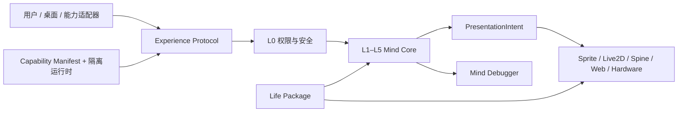

# 参考项目研究与吸收矩阵

本页记录 LIFE-Mind 从成熟项目中学习什么，以及明确不照搬什么。结论来自项目官方仓库或
官方文档在 2026-07-17 前后的公开状态；这里只学习接口、产品和安全原则，不复制代码、
角色素材、商标或不兼容许可证内容。

## 逐项吸收

| 参考项目 | 经官方资料确认的优势 | LIFE-Mind 的吸收方式 | 不直接照搬 |
|---|---|---|---|
| [Open-LLM-VTuber](https://github.com/Open-LLM-VTuber/Open-LLM-VTuber) | LLM、ASR、TTS 和 Agent 可替换；本地/云端、Web/桌面和 Live2D 表现分离；思考、动作与说出的话可区分 | 用 `ports.py` 定义模型、语音和渲染端口；Mind Core 不依赖某个 UI 或模型；Narrated Self 只能表达、不能改人格 | 不把 Prompt 和聊天历史当完整人格；不默认持续读取屏幕或摄像头 |
| [AIRI](https://github.com/moeru-ai/airi) | 用统一供应商抽象接入大量本机与云端模型，设置页集中处理服务、密钥、地址和错误反馈 | 提供 Ollama、OpenAI 兼容、Anthropic 三类协议适配器；常用厂商用预设，长尾服务走自定义兼容地址；密钥进入系统凭据库 | 不把“列出很多厂商”当作兼容证明；企业 IAM 和非标准协议必须单独验证，不在文档中虚假承诺 |
| [VPet](https://github.com/LorisYounger/VPet) | 无 AI 也完整可玩；动画、投喂、物品、工作、主题和代码插件组成创意工坊生态；核心可嵌入其他 WPF 应用 | 先补触摸、物品、兴趣作品和日常小循环；角色、表现与能力独立打包；Mind Core 可被其他宿主嵌入 | 不复制其动画素材；不把成长简化为喂养数值和等级 |
| [Petdex](https://petdex.dev/docs) | `discover → install → hatch → publish` 的 CLI 生命周期；角色包与桌面程序分离；Agent hook 映射为少量状态 | 为 Life Package 设计 validate/pack/install/inspect 命令和可重现 lockfile；外部 Hook 必须先转 Experience Protocol | 不要求使用中心账号才能本地安装；不让 Hook 直接写心智状态 |
| [OpenPets](https://openpets.dev/docs/pet-format) | Manifest 权限、独立沙箱、精确 HTTPS 主机、生命周期清理、哈希固定、目录穿越检查、审核后发布 | Capability Runtime 的最低门槛照此定义：隔离、最小权限、网络代理、配额、撤权、审计和包溯源缺一不可 | 不把“有 Manifest”写成“已有沙箱”；完成隔离前不加载不受信任代码 |
| [DyberPet](https://github.com/ChaozhongLiu/DyberPet) | 动画、互动、养成、任务、商店和迷你宠物形成完整产品；JSON 模组易入门；AI 是增强而非前置 | 保证离线规则和日常玩法独立成立；用数据包承载物品、声音、房间和活动 | 不同时堆满商店、任务、等级等系统；每个玩法必须能表现角色生活或成长证据 |
| [desktopPet/eSheep](https://github.com/Adrianotiger/desktopPet) | 能感知任务栏、窗口和多显示器；简单 XML 即可换宠物；桌面本身成为生活空间 | 增加只读 Desktop Surface Adapter，让角色知道安全坐点、遮挡和当前屏幕 | 用户已明确不要角色随意在桌面乱跑；空间感知用于选位和避让，不自动巡游 |
| [Claude Desktop Buddy](https://github.com/anthropics/claude-desktop-buddy) | 七种状态含义清楚；GIF 包简单；同角色跨状态保持统一尺度；idle 可轮换多个片段 | 建立 `PresentationIntent` 表现压缩层、符号语义、缺失动作回退和统一尺度 QA；额外保留 LIFE-Mind 的 `private_life` | 不把 Token、等级或一次批准直接当人格成长；少量公开状态不能反向暴露黑箱变量 |

## 综合后的框架



从这些项目吸收的是成熟的“外壳和生态做法”，LIFE-Mind 自己负责它们普遍没有形成完整闭环
的部分：

```text
经验 → 解释 → 情绪 → 选择 → 结果 → 反思 → 证据 → 关系/信念/人物弧变化
```

## LIFE-Mind 不可让步的差异

1. **外部只能提交经验。** UI、模型和插件不能直接改关系、人格或成长阶段。
2. **AI 是解释器和表达器。** 模型离线时角色仍能生活；Narrated Self 不等于 Core Self。
3. **她拥有任务外生活。** 兴趣、休息、作品和私人选择不是随机 idle，也不只服务用户。
4. **成长必须有证据和代价。** 单句道歉、一次夸奖或一次模型输出不能完成修复或升级人格。
5. **普通体验保持黑箱。** Pet Host 只拿到少量表现意图；内部变量和候选分数只进调试器。
6. **安全先于生态。** 观察、记忆、使用、行动和分享是五种独立权利；插件便利不能越过它们。
7. **角色包只定义出生条件。** 包可以给范围、潜质和冲突，不能预写她最终会成为谁。

## 已经落实到仓库的内容

- 三项协议及 JSON Schema：Life Package、Capability Manifest、Experience Protocol；
- 模型、语音、能力和 Pet Renderer 的宿主无关端口；
- `PresentationIntent` 小状态词汇、符号映射、缺失动作安全回退与黑箱泄漏测试；
- AI 可选、确定性回放、关系修复、记忆用途、单人物弧和私人数据发布隔离；
- 本机/云端统一 AI 设置、常用供应商预设、系统凭据库、远程数据许可和记忆共享开关；
- 后续工作拆成可直接建立 GitHub Issue 的[实施任务](IMPLEMENTATION_BACKLOG.md)。

## 许可证边界

参考链接只作为研究出处。任何将来真正复用的代码或资源都必须单独记录来源、版本、许可证、
修改和 NOTICE 要求；不确定时只重做接口思想，不复制实现。VPet 也明确区分程序许可证与动画
素材授权，因此“项目开源”不能推导出“其中所有素材都可自由再发布”。
